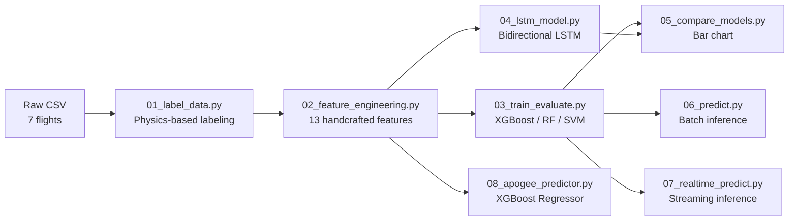
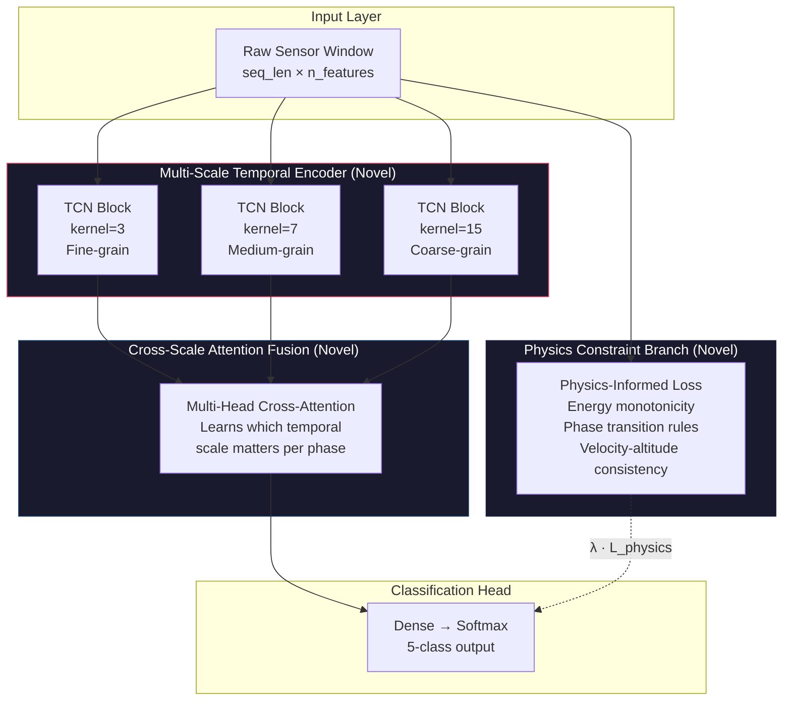

# DM_Project Analysis & Novel Model Proposal

## 1. Current Project Analysis

### What the project does
**Sounding Rocket Flight Phase Classification** — classifies telemetry data from 7 sounding rocket flights into 5 flight phases: **Boost → Coast → Apogee → Descent → Landed**.

### Pipeline architecture



### Models currently used

| Model | Type | Source | Custom? | Mean Macro F1 |
|-------|------|--------|---------|---------------|
| XGBoost | Gradient Boosted Trees | `xgboost` library | ❌ Off-the-shelf | ~0.840 |
| Random Forest | Ensemble Bagging | `sklearn` | ❌ Off-the-shelf | ~0.837 |
| SVM (RBF) | Kernel SVM | `sklearn` | ❌ Off-the-shelf | ~0.715 |
| Bidirectional LSTM | Deep Learning | `tensorflow.keras` | ❌ Off-the-shelf | ~0.731 |
| XGBoost Regressor | Regression (Apogee) | `xgboost` | ❌ Off-the-shelf | N/A |

### 13 Engineered Features
`alt_diff`, `vel_diff`, `acc_proxy`, `jerk_proxy`, `alt_rolling_mean`, `vel_rolling_mean`, `alt_rolling_std`, `vel_rolling_std`, `speed_abs`, `is_ascending`, `vel_sign_change`, `energy_proxy`, `altitude_from_ground`

### Evaluation protocol
Leave-One-Rocket-Out Cross-Validation (LORO-CV) — trains on 6 flights, tests on 1, rotates.

---

## 2. Novelty Assessment

> [!CAUTION]
> **There is ZERO custom or novel model architecture in this project.** Every model is a direct import from a library with default or slightly tuned hyperparameters. The LSTM is a standard 2-layer Bidirectional LSTM — a textbook architecture with no modifications.

### What IS good (keep these):
- ✅ Physics-based automatic labeling (state code → phase refinement)
- ✅ Leave-One-Rocket-Out CV (genuine cross-vehicle generalization)
- ✅ Domain-specific feature engineering (energy proxy, jerk proxy)
- ✅ Real-time streaming inference system
- ✅ Apogee prediction from boost-phase only

### What IS NOT novel (problems for a research paper):
- ❌ No custom model architecture
- ❌ No physics-informed learning (physics is only in preprocessing, not in the model itself)
- ❌ No attention mechanisms for temporal dependencies
- ❌ No multi-scale temporal analysis
- ❌ No uncertainty quantification
- ❌ SMOTE is used for class imbalance — a standard technique with no innovation

---

## 3. Proposed Novel Model: **PhaseNet** — Physics-Informed Multi-Scale Temporal Fusion Network

> [!IMPORTANT]
> This is a custom architecture specifically designed for sounding rocket flight phase classification. It is not available in any library — you build it yourself. This is your primary novelty claim.

### 3.1 Architecture Overview



### 3.2 Three Layers of Novelty

#### Novelty 1: Multi-Scale Temporal Convolutional Encoder
Instead of a single LSTM scanning left-to-right, use **parallel dilated TCN branches** with different kernel sizes to capture patterns at different time scales:
- **Fine-grain (k=3):** Detects rapid transitions (motor ignition, parachute deploy)
- **Medium-grain (k=7):** Captures phase-level dynamics (boost acceleration profile)
- **Coarse-grain (k=15):** Understands flight-level trajectory shape

**Why this is novel:** Standard TCN uses a single scale. Multi-scale parallel TCN for rocket telemetry classification has not been done.

#### Novelty 2: Cross-Scale Attention Fusion
A learnable attention mechanism that **dynamically weighs which temporal scale is most informative for each time step**:
- During `Boost`: fine-grain features dominate (rapid acceleration changes)
- During `Coast/Apogee`: coarse-grain features dominate (smooth trajectory)
- At `transitions`: medium-grain features provide the best signal

**Why this is novel:** Instead of concatenation or averaging, attention-based fusion allows the model to be *interpretable* — you can visualize which scale the model relied on for each prediction. This gives you a publishable attention heatmap figure.

#### Novelty 3: Physics-Informed Constraint Loss
Add a **secondary loss term** that penalizes physically impossible predictions:

```
L_total = L_CE + λ₁·L_energy + λ₂·L_transition + λ₃·L_kinematics
```

| Constraint | What it enforces | Formula |
|------------|-----------------|---------|
| `L_energy` | Energy must decrease after apogee (no free energy) | Penalize if predicted phase = Descent but energy is increasing |
| `L_transition` | Phase transitions must follow the legal order: Boost→Coast→Apogee→Descent→Landed | Penalize illegal transitions (e.g., Boost→Landed) |
| `L_kinematics` | Velocity sign must match phase | Penalize if predicted = Boost but velocity < 0 |

**Why this is novel:** Physics constraints are embedded **inside the loss function**, not just in preprocessing. The model learns physics-aware representations. This is a drastically different approach from your current system where physics is only used for labeling.

### 3.3 Concrete Architecture Specification

```
PhaseNet Architecture:
├── Input:                    (batch, seq_len=20, n_features=20)
│
├── Multi-Scale TCN Encoder:
│   ├── Scale-1 (fine):       4 × DilatedCausalConv1D(k=3, d=[1,2,4,8], filters=64) + LayerNorm + GELU
│   ├── Scale-2 (medium):     3 × DilatedCausalConv1D(k=7, d=[1,2,4], filters=64) + LayerNorm + GELU
│   └── Scale-3 (coarse):     2 × DilatedCausalConv1D(k=15, d=[1,2], filters=64) + LayerNorm + GELU
│   Output: 3 × (batch, seq_len, 64)
│
├── Cross-Scale Attention Fusion:
│   ├── Concat → (batch, seq_len, 192)
│   ├── MultiHeadAttention(heads=4, key_dim=48)
│   ├── Residual + LayerNorm
│   └── Output: (batch, seq_len, 192)
│
├── Temporal Aggregation:
│   └── GlobalAveragePooling1D → (batch, 192)
│
├── Classification Head:
│   ├── Dense(128, GELU) + Dropout(0.3)
│   ├── Dense(64, GELU)  + Dropout(0.2)
│   └── Dense(5, Softmax) → (batch, 5)
│
└── Loss: L_CE + 0.1·L_energy + 0.2·L_transition + 0.1·L_kinematics
```

**Total parameters:** ~180K (lightweight — suitable for edge deployment / real-time)

---

## 4. Implementation Roadmap

### Phase 1: Build PhaseNet Model (New file: `09_phasenet_model.py`)

```python
# Key components to implement:
class DilatedCausalConvBlock(tf.keras.layers.Layer):    # TCN building block
class MultiScaleTemporalEncoder(tf.keras.layers.Layer): # Parallel TCN branches
class CrossScaleAttention(tf.keras.layers.Layer):       # Attention fusion
class PhysicsConstraintLoss(tf.keras.losses.Loss):      # Custom loss
class PhaseNet(tf.keras.Model):                          # Full model
```

### Phase 2: Training Script
- Same LORO-CV protocol as existing models
- Add learning rate warmup + cosine annealing
- Track attention weights for interpretability plots

### Phase 3: Comparison & Analysis (Enhance `05_compare_models.py`)
- Add PhaseNet to the comparison chart
- Generate attention heatmaps (which scale matters when)
- Ablation study: PhaseNet vs PhaseNet-no-physics vs PhaseNet-single-scale

### Phase 4: Real-Time Integration (Update `07_realtime_predict.py`)
- Add PhaseNet as a model option for streaming inference
- Benchmark latency per prediction

---

## 5. Research Paper Framing

### Suggested Paper Title
> *"PhaseNet: A Physics-Informed Multi-Scale Temporal Fusion Network for Automated Sounding Rocket Flight Phase Classification"*

### Contribution Claims (4 contributions — strong for a conference/journal paper)

1. **A novel multi-scale temporal architecture** that captures flight dynamics at different temporal granularities using parallel dilated TCN branches
2. **An attention-based cross-scale fusion mechanism** that learns to dynamically weight temporal scales per flight instant — providing built-in model interpretability
3. **A physics-informed constraint loss** that embeds domain knowledge (energy conservation, legal phase transitions, kinematic consistency) directly into the training objective
4. **Comprehensive evaluation** on real sounding rocket telemetry from 7 flights using Leave-One-Rocket-Out CV, with comparison against XGBoost, Random Forest, SVM, and LSTM baselines

### Ablation Study Table (you'd produce this)

| Model Variant | Macro F1 | Notes |
|--------------|----------|-------|
| XGBoost (baseline) | 0.840 | Off-the-shelf |
| LSTM (baseline) | 0.731 | Standard BiLSTM |
| PhaseNet (single-scale, no physics) | ~TBD | Ablation |
| PhaseNet (multi-scale, no physics) | ~TBD | Ablation |
| PhaseNet (multi-scale, no attention) | ~TBD | Ablation |
| **PhaseNet (full)** | **~TBD** | **Proposed** |

---

## 6. Alternative / Lighter Novelty Options

If PhaseNet feels too ambitious, here are simpler novelty options (ranked by novelty strength):

### Option B: Physics-Constrained LSTM (Medium novelty)
- Keep the existing BiLSTM but add the physics-informed loss
- Novelty: custom loss function only
- Effort: ~1 day
- Paper strength: ⭐⭐⭐

### Option C: Attention-Enhanced XGBoost Ensemble (Medium novelty)
- Use attention to weight predictions from multiple XGBoost models trained at different temporal windows
- Novelty: meta-learner with attention
- Effort: ~1 day
- Paper strength: ⭐⭐⭐

### Option D: TCN + Physics Loss (High novelty, simpler than PhaseNet)
- Single-scale TCN (replacing LSTM) + physics-informed loss
- Novelty: TCN for rocket classification + custom loss
- Effort: ~2 days
- Paper strength: ⭐⭐⭐⭐

---

## 7. Files That Will Be Created/Modified

### New Files
| File | Purpose |
|------|---------|
| [NEW] `09_phasenet_model.py` | PhaseNet training & evaluation (~300 lines) |
| [NEW] `phasenet_layers.py` | Custom Keras layers (TCN blocks, attention, physics loss) (~200 lines) |

### Modified Files
| File | Change |
|------|--------|
| [MODIFY] `config.py` | Add PhaseNet hyperparameters (kernel sizes, λ weights, etc.) |
| [MODIFY] `05_compare_models.py` | Include PhaseNet in comparison chart |
| [MODIFY] `07_realtime_predict.py` | Add PhaseNet as streaming model option |
| [MODIFY] `utils.py` | Add PhaseNet model loading helper |

---

## Open Questions

> [!IMPORTANT]
> **Which option do you want to go with?**
> - **Option A (PhaseNet — full):** Maximum novelty, ~3-4 days of work, 4 contribution claims
> - **Option B (Physics LSTM):** Moderate novelty, ~1 day, 1-2 claims
> - **Option C (Attention Ensemble):** Moderate novelty, ~1 day, 1-2 claims
> - **Option D (TCN + Physics):** High novelty, ~2 days, 2-3 claims

> [!WARNING]
> With only **7 flights** of data, very deep/complex models risk overfitting. PhaseNet is designed to be lightweight (~180K params) specifically because of this. The physics loss also acts as a **regularizer**, which helps with small datasets. This is actually a selling point in the paper — "our physics-informed loss provides implicit regularization on small-sample aerospace datasets."

## Verification Plan

### Automated Tests
- Run `09_phasenet_model.py` with LORO-CV and compare Macro F1 against all baselines
- Run ablation variants (remove physics loss, single-scale, no attention)
- Verify model can be loaded and used in `07_realtime_predict.py`

### Manual Verification
- Inspect attention heatmaps for physical plausibility
- Verify physics loss actually reduces illegal phase transitions
- Compare confusion matrices across all models
